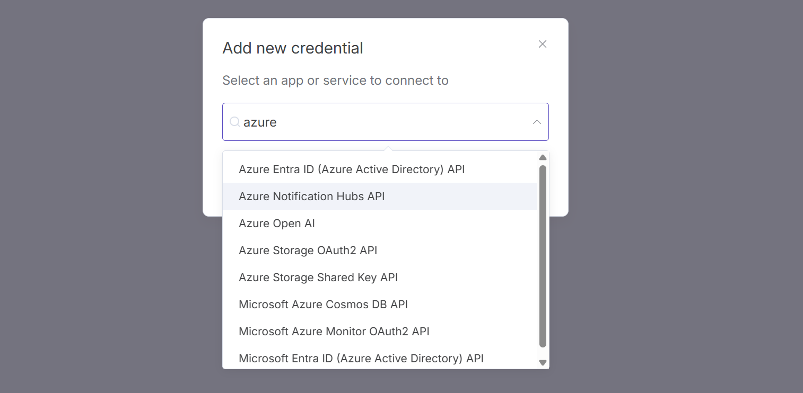
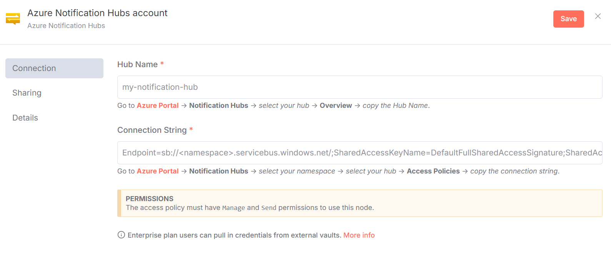
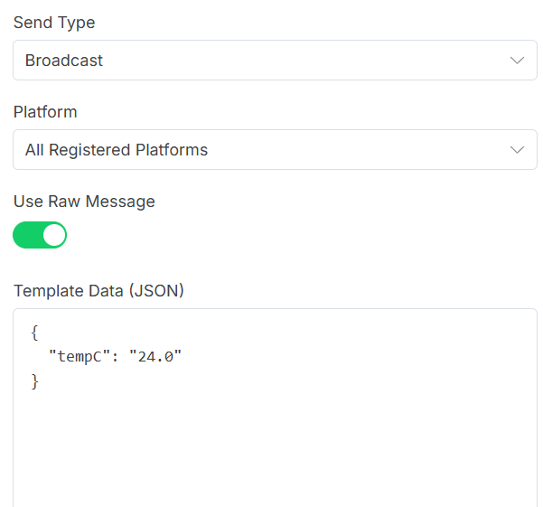

# n8n-nodes-anh

This is an n8n community node. It lets you use [_Azure Notification Hubs_](https://azure.microsoft.com/en-us/products/notification-hubs) in your n8n workflows.

_Azure Notification Hubs is a cross-platform push notification routing service that lets you send messages from a single backend to millions of devices. It handles platform-specific formatting and supports targeting through tags and templates._

[n8n](https://n8n.io/) is a [fair-code licensed](https://docs.n8n.io/reference/license/) workflow automation platform.

1. [Installation](#installation)
1. [Operations](#operations)
1. [Credentials](#credentials)
1. [Compatibility](#compatibility)
1. [Usage](#usage)
1. [Resources](#resources)
1. [Development](#development)

## Installation

Follow the [installation guide](https://docs.n8n.io/integrations/community-nodes/installation/) in the n8n community nodes documentation. This module is named `n8n-nodes-anh`.

## Operations

This node supports the following `Send` types:

|Send Type|Description|
|:-|:-|
|**Audience**|Sends to a specific audience using tags.|
|**Broadcast**|Sends to all registered devices.|
|**Direct**|Sends to a specific device handle.|
|**Scheduled**|Sends at a specified future time.|

> **NOTICE**
> This module only supports raw template notifications at this time.


## Credentials

To use this node, you need credentials. To acqure credentials, you must:

1. [Sign up](https://azure.microsoft.com/en-us/pricing/purchase-options/azure-account?icid=azurefreeaccount) for an Azure account if you do not already have one.
1. Follow the [Azure Notification Hub Quickstart](https://learn.microsoft.com/en-us/azure/notification-hubs/create-notification-hub-portal) to create a namespace and notification hub.
1. In the [Azure Portal](https://portal.azure.com/), go to `Notification Hubs` → _select your hub_ → `Overview` → _copy the Hub Name_.
1. In the [Azure Portal](https://portal.azure.com/), go to `Notification Hubs` → _select your namespace_ → _select your hub_ → `Access Policies` → _copy the connection string_.

> **PERMISSIONS**
> The access policy must have `Manage` and `Send` permissions for this node to work. `Listen` is not required, but will not prevent this node from working.

Once you've acquired Azure Notification Hub credentials, use them to [create a new n8n credential](https://docs.n8n.io/credentials/add-edit-credentials/). Select `Azure Notification Hubs` as the credential type:





## Compatibility

This node was written and tested in the following environment:

- n8n v1.108.1
- platform: npm
- Node.js v24.0.0
- database: sqlite
- executionMode: regular
- concurrency: -1
- license: community

## Usage

Azure Notification Hubs supports many different platforms:

- [Apple Push Notification Service (APNS)](https://developer.apple.com/notifications/)
- [Firebase Cloud Messaging (FCM)](https://firebase.google.com/docs/cloud-messaging)
- [Windows Notification Service](https://learn.microsoft.com/en-us/windows/apps/develop/notifications/push-notifications/wns-overview)
- [Many others](https://learn.microsoft.com/en-us/azure/notification-hubs/notification-hubs-push-notification-faq#which-client-platforms-do-you-support-)

Each of these platforms have specific notification formats. At this time, this node does **not** support GUI creation of these types of messages.

**This node supports [Notification Hubs templates](https://learn.microsoft.com/en-us/azure/notification-hubs/notification-hubs-templates-cross-platform-push-messages).**

Your client application implements templates with device registration. For example a Windows notification template may look like:

```xml
<toast>
  <visual>
    <binding template="ToastText01">
      <text id="1">$(tempC)</text>
    </binding>
  </visual>
</toast>
```

In your Azure Notification Hubs workflow node, provide JSON to populate this template. In this example, that would look like:

```js
{
  "tempC": "24.0"
}
```



A successful send will return the following output:

```js
{
  correlationId,
  trackingId,
  notificationId, // Only available in Standard and above (not Free/Basic)
  successCount,
  failureCount,
  results,
  state
}
```

### Audience Send

This module supports sending to audiences through the use of tags and expressions. You can add as many tag groups as needed. Each tag group can be a single tag, a comma separated list of tags, or expression(s).

When multiple groups (tag items) are provided, they are treated as an "OR" operation. In other words, the notificaiton will be sent to members of `"group 1" OR "group 2" OR "group 3"`. This translates to `(group 1) || (group 2) || (group 3)`. If you need to use more complex logic, you can use a single group to provide a complete tag expression.

## Resources

* [n8n community nodes documentation](https://docs.n8n.io/integrations/#community-nodes)

## Development

I created this node because I needed native push notification capabilities in n8n, which does not exist. It currently only supports template notifications because that provides the broadest support for all use cases.

Ideally, this node would provide more visual ways to construct notifications for each platform. I added some inert placeholders in the input form during my initial development as I experimented with this. However; I do not have time to fully flesh this out and test it.

I am open to PRs that add more support for individual platforms. However; I request that anyone considering this open a discussion or issue to briefly discuss it beforehand. You'll find I'm pretty amenable, but there are a few high level standards to adhere to.

_Ideally_, **if anyone from the Azure Notification Hubs team finds this, I would be more than happy to transfer this repo to you**. I feel this is a missing piece in the n8n ecosystem, and it would be best to have the team behind it supporting it.

Copyright &copy; 2025, Corey Butler. MIT License.